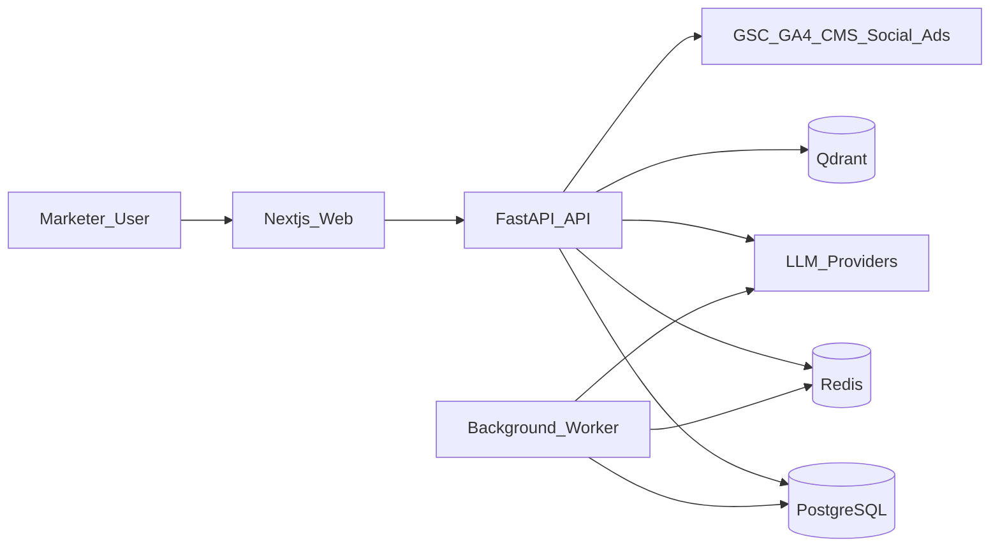
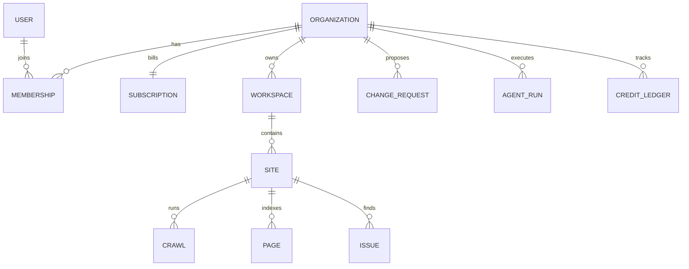
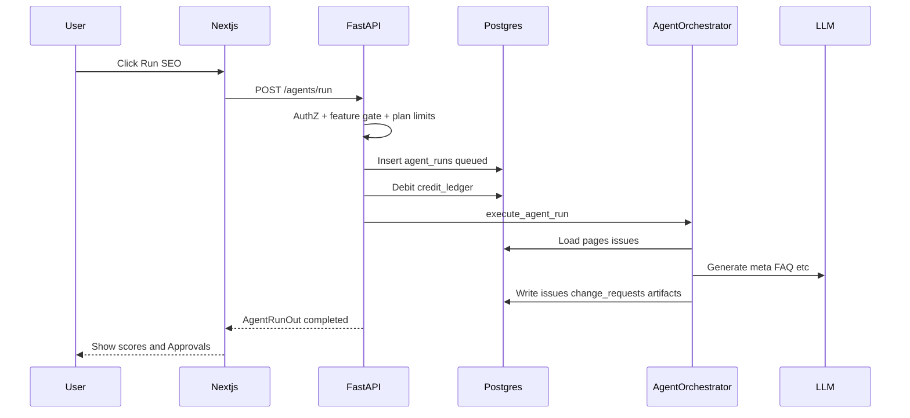
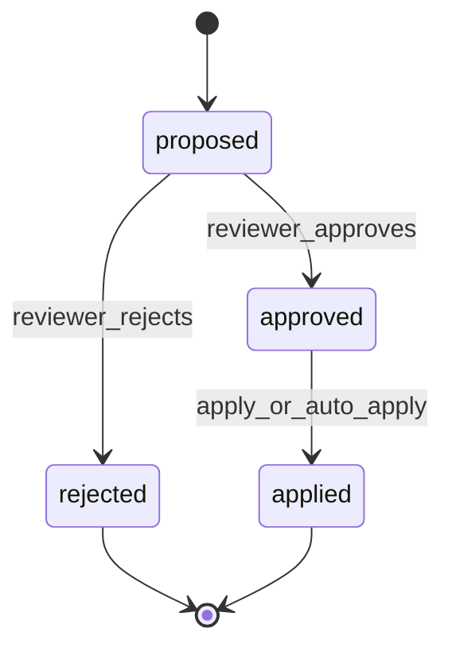
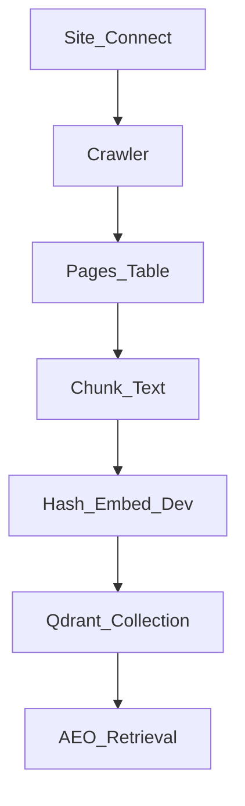
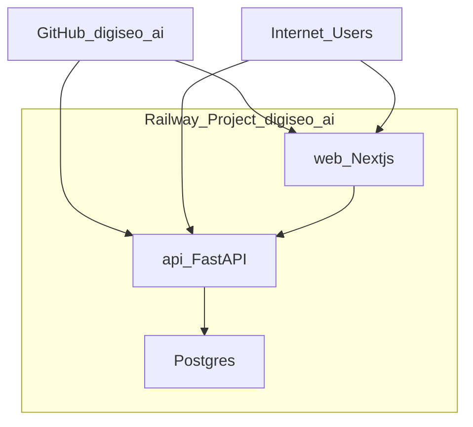

# DigiSEO AI — Architecture

## 1. Purpose

DigiSEO AI is a multi-tenant SaaS that orchestrates specialized marketing agents (SEO, AEO, content, social, competitor, keywords, backlinks, PPC, analytics, local SEO) behind a Next.js product UI and a FastAPI gateway.

## 2. High-level system context

## 3. Logical architecture

| Layer | Technology | Responsibility |
|-------|------------|----------------|
| Presentation | Next.js 15 App Router, Tailwind | Marketing site, auth UX, dashboards |
| API gateway | FastAPI | JWT/org context, REST `/api/v1/*`, Stripe webhooks |
| Agents | LangGraph-oriented orchestrator | Specialist agent graphs, credit debit, artifacts |
| Workers | Python async worker | Queued agent runs |
| Primary data | PostgreSQL | Tenancy, sites, issues, content, billing ledger |
| Cache / queue | Redis | Jobs, rate limits (optional locally) |
| Vectors | Qdrant | Page chunk embeddings for AEO retrieval |
| Deploy | Railway | Separate `digiseo-ai` project: web, api, Postgres |

## 4. Multi-tenancy model

**Roles:** `owner`, `admin`, `editor`, `viewer`  
**Headers:** `Authorization: Bearer <jwt>`, `X-Org-Id`, optional `X-Workspace-Id`, optional `X-API-Key`

Every tenant-owned row is scoped by `organization_id` (and usually `workspace_id`).

## 5. Request path

## 6. Agent fleet

Agents are LangGraph-style subgraphs dispatched by `apps/api/app/agents/orchestrator.py`.

| Agent | Feature flag | Typical credits |
|-------|--------------|-----------------|
| seo | seo_audit | 25 |
| aeo | aeo | 20 |
| content | blog_generation | 40 |
| keyword | gsc | 15 |
| social | social | 10 |
| competitor | competitor | 20 |
| analytics | analytics | 10 |
| backlink | backlink | 25 |
| ppc | ppc | 30 |
| local_seo | local_seo | 20 |
| launch_product | multi_agent | 80 |

**Supervisor workflow (`launch_product`):** keyword → content → aeo → social → analytics.

## 7. Human-in-the-loop

`change_requests` store payload (meta, schema, internal links, social replies). Business+ may set `auto_apply_enabled`.

## 8. Crawl & vector pipeline

Local/demo: `MOCK_CRAWL=true`, deterministic hash embeddings. Production: HTTP crawl + optional real embedding providers.

## 9. Deployment architecture (Railway)

| Service | Root directory | Health |
|---------|----------------|--------|
| api | `apps/api` | `/health` |
| web | `apps/web` | `/` |
| Postgres | plugin | internal URL → asyncpg |

## 10. Security baseline

- JWT sessions; org membership required
- Plan feature gates on every agent/integration route
- OAuth tokens stored encrypted fields (`*_enc`) — production uses KMS
- Secrets via env (never commit `.env`)
- Approval audit trail for publish/outreach
- Enterprise: API keys, SSO stub, white-label, audit logs

## 11. Key code map

| Area | Path |
|------|------|
| API entry | `apps/api/app/main.py` |
| Routes | `apps/api/app/api/v1/` |
| Models | `apps/api/app/models/` |
| Agents | `apps/api/app/agents/orchestrator.py` |
| Crawler | `apps/api/app/services/crawler.py` |
| Plans | `apps/api/app/core/plans.py` |
| Web app | `apps/web/src/app/` |
| Agent SDK contracts | `packages/agent-sdk/` |

## 12. Related docs

- [DIAGRAMS.md](DIAGRAMS.md) — all Mermaid diagrams  
- [USER_GUIDE.md](../USER_GUIDE.md)  
- [FUNCTIONAL_SPEC.md](../functional/FUNCTIONAL_SPEC.md)  
- [RAILWAY.md](../deploy/RAILWAY.md)  
