# DigiSEO AI — Diagram Pack

All diagrams use Mermaid. Render in GitHub, VS Code Mermaid preview, or Notion.

---

## 1. System context (C4 level 1)

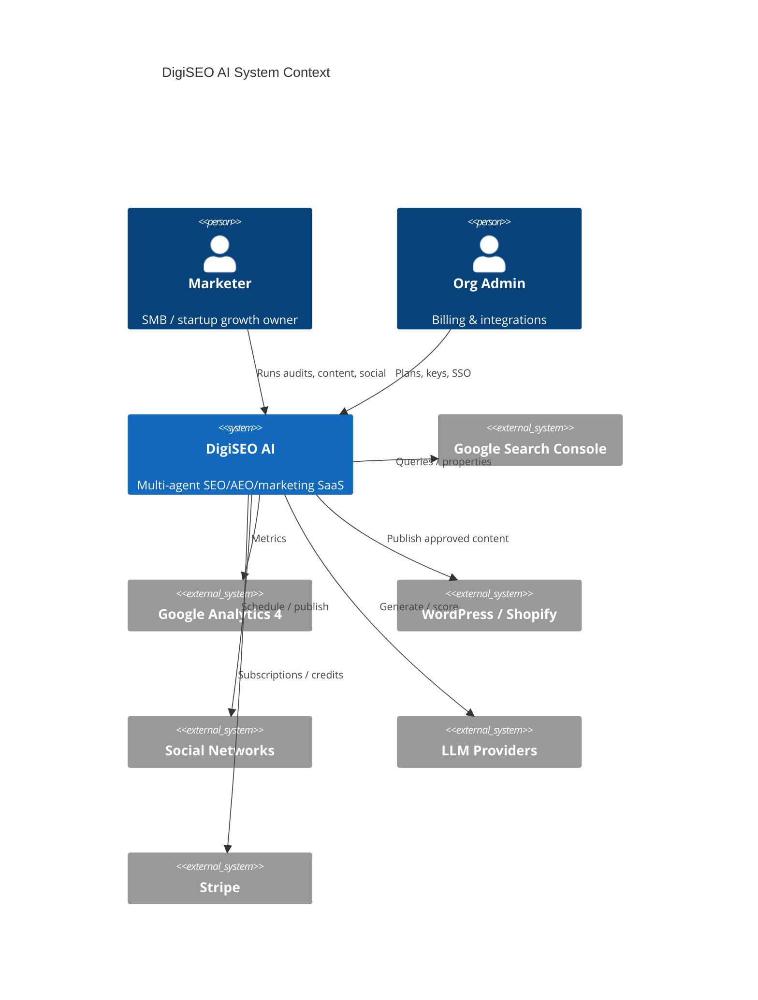

> If C4 Mermaid is unsupported in your viewer, use §2 instead.

---

## 2. Container diagram

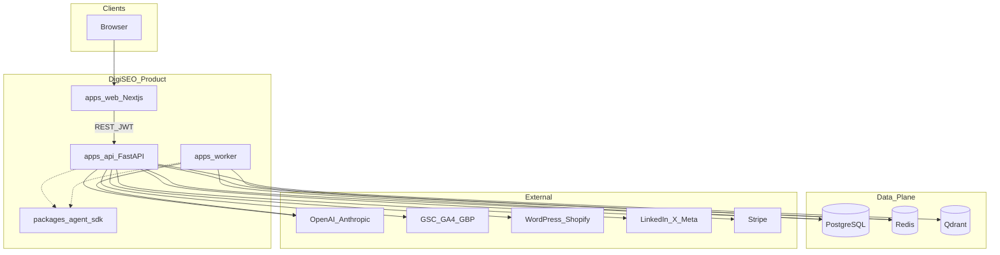

---

## 3. Functional capability map

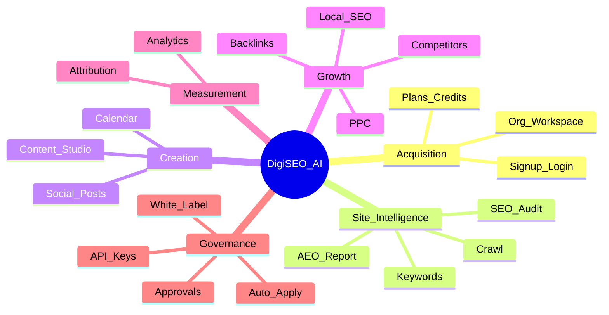

---

## 4. User journey — first week

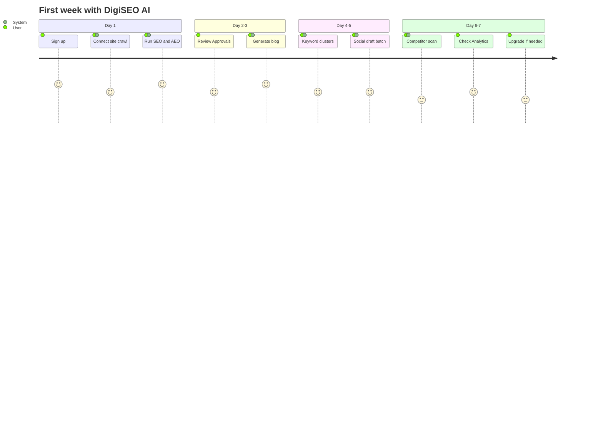

---

## 5. Auth & tenancy sequence

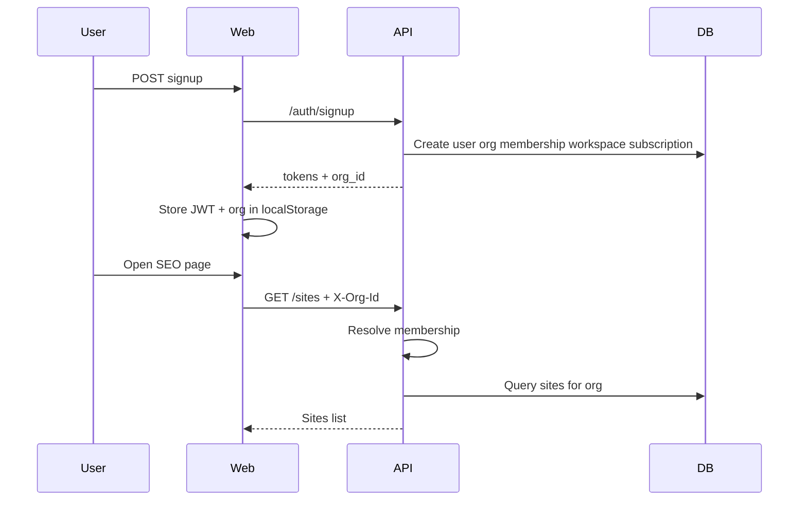

---

## 6. Agent run state machine

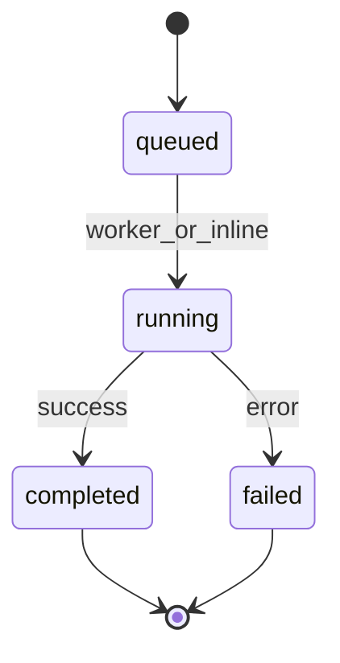

---

## 7. Approval & publish flow

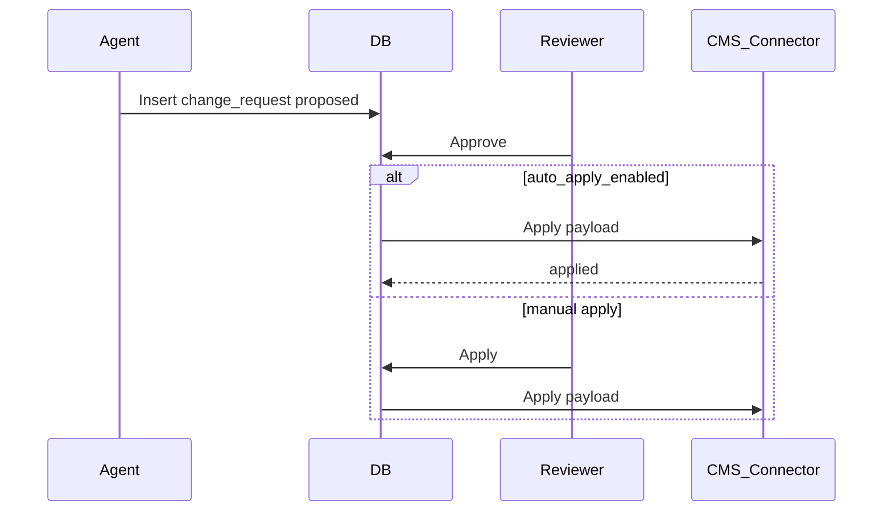

---

## 8. Billing & credits

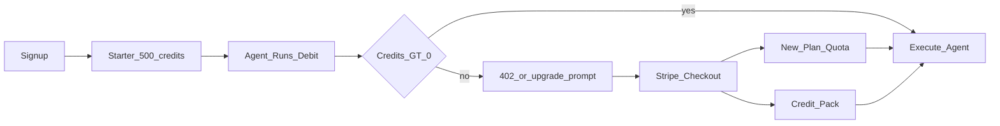

---

## 9. Feature gating by plan

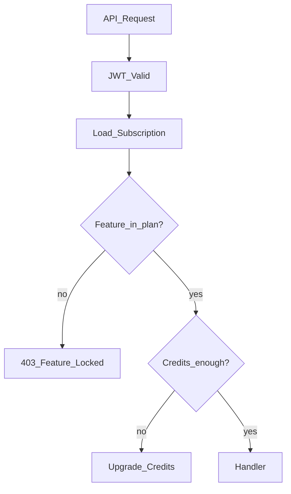

---

## 10. Data model (core entities)

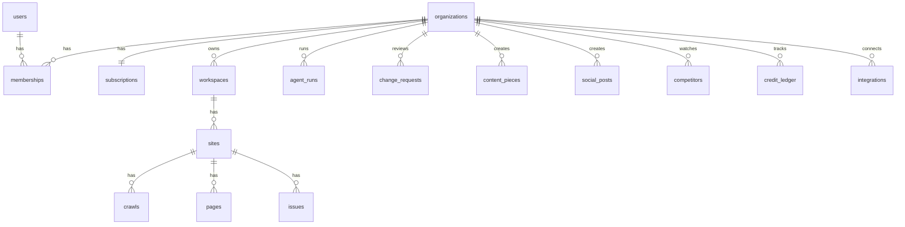

---

## 11. Multi-agent launch_product orchestration

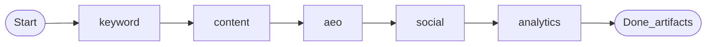

---

## 12. Component view — API modules

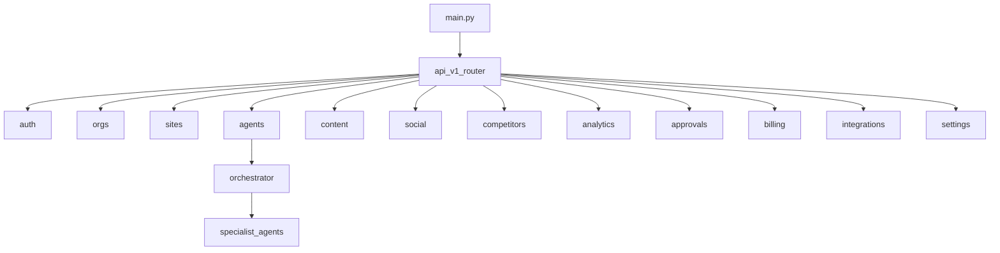

---

## 13. Deployment topology

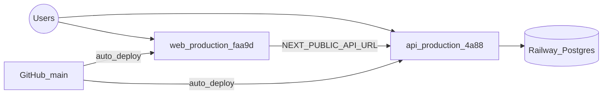

---

## 14. Local development topology

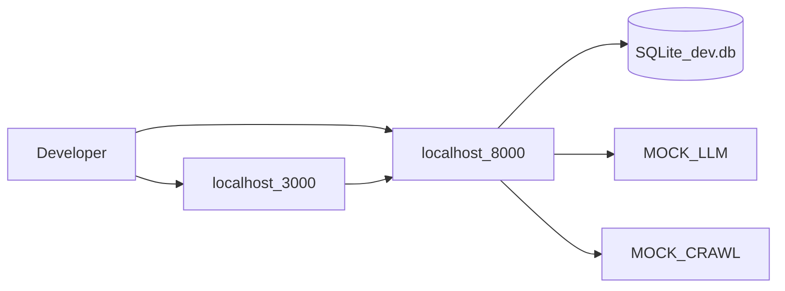

---

## 15. Threat / trust boundaries (simplified)

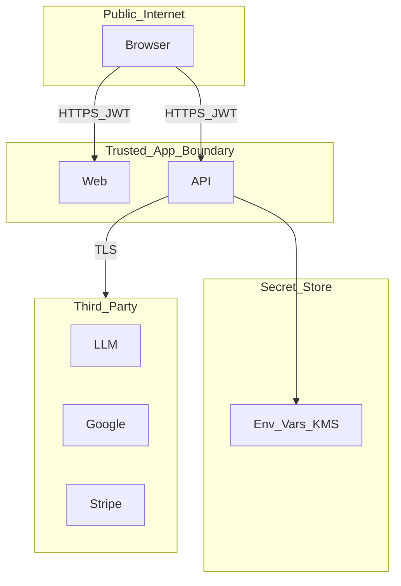
