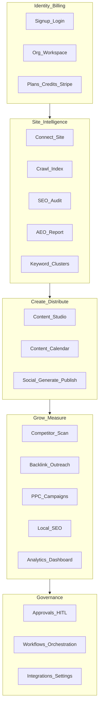
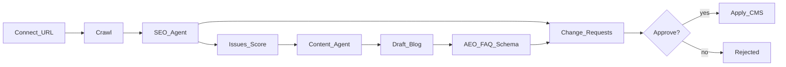
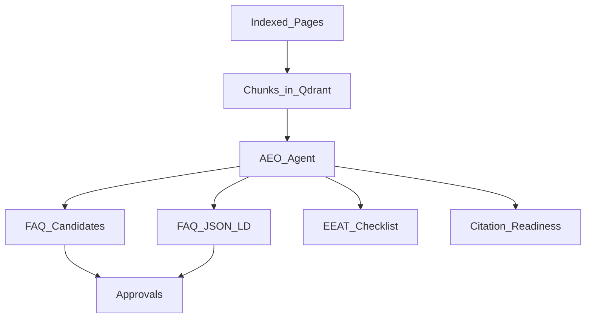
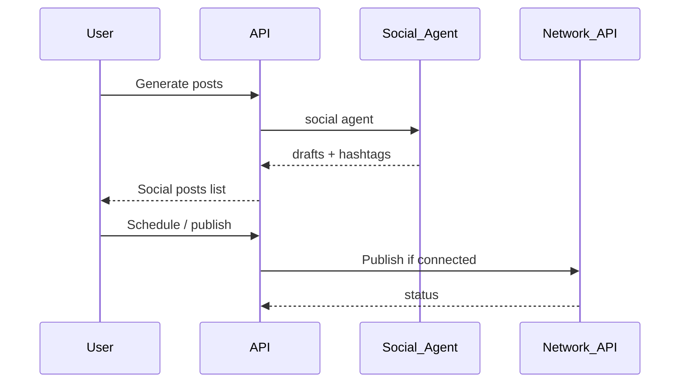

# DigiSEO AI — Functional Specification

## 1. Product summary

DigiSEO AI helps SMBs and startups run SEO, AEO, content, social, and growth workflows through specialized AI agents, with plan-based feature gates and human approval for outbound changes.

## 2. Actors

| Actor | Goals |
|-------|-------|
| Owner / Admin | Signup, billing, integrations, API keys, SSO |
| Editor | Crawl sites, run agents, generate content, approve changes |
| Viewer | Read dashboards and reports |
| System | Orchestrate agents, debit credits, enqueue jobs |
| External APIs | GSC, GA4, CMS, social, ads, Stripe, LLMs |

## 3. Functional domains

## 4. Use cases (priority)

### P0 — Core funnel
| ID | Use case | Plan |
|----|----------|------|
| UC-01 | Sign up and create org/workspace | All |
| UC-02 | Connect website and crawl | All |
| UC-03 | Run SEO audit | All |
| UC-04 | Run AEO report | All |
| UC-05 | Generate blog content | All |
| UC-06 | Review/approve change requests | All |
| UC-07 | View credits and upgrade plan | All |

### P1 — Growth
| ID | Use case | Plan |
|----|----------|------|
| UC-08 | Keyword research from GSC | All |
| UC-09 | Social post generation | Professional+ |
| UC-10 | Content calendar | Professional+ |
| UC-11 | Competitor watchlist + scan | Professional+ |
| UC-12 | Analytics dashboard | Professional+ |
| UC-13 | CMS / analytics integrations | Professional+ |

### P2 — Advanced
| ID | Use case | Plan |
|----|----------|------|
| UC-14 | Multi-agent launch workflow | Business+ |
| UC-15 | Backlink discovery + outreach | Business+ |
| UC-16 | PPC campaign drafts | Business+ |
| UC-17 | Local SEO optimize | Business+ |
| UC-18 | API key access | Business+ |
| UC-19 | Auto-apply approved changes | Business+ |
| UC-20 | White-label + SSO | Enterprise |

## 5. Functional flow — SEO to publish

## 6. Functional flow — AEO

## 7. Functional flow — social (Pro+)

## 8. Business rules

1. **Org isolation:** All queries filter by `organization_id`.
2. **Feature gates:** `plans.py` maps plan → allowed features; deny with clear upgrade message.
3. **Credits:** Agent runs debit `credit_ledger` before/during execution; block if insufficient.
4. **Approvals:** Mutating external content requires `change_requests` unless Enterprise policy + auto-apply.
5. **Workspace scope:** Sites and runs belong to a workspace under an org.
6. **Idempotent crawl:** New crawl supersedes stale page rows for the site.
7. **Mock mode:** `MOCK_LLM` / `MOCK_CRAWL` produce deterministic demo results without paid APIs.

## 9. Non-functional requirements

| Area | Target |
|------|--------|
| Availability | API `/health` for probes |
| Latency | Interactive pages < 2s TTFB typical; agent runs async-capable |
| Security | JWT, org ACL, encrypted OAuth tokens |
| Scalability | Horizontal API/web; Postgres primary; Redis queue for workers |
| Observability | Structured logs; Railway metrics |
| Compliance posture | Approval audit trail; least-privilege integrations |

## 10. Screen ↔ capability matrix

| Screen | Capabilities |
|--------|--------------|
| Landing | Value prop, pricing CTAs |
| Signup / Login | UC-01 |
| Overview | Sites, scores, credits |
| Onboarding | UC-02 |
| SEO / AEO | UC-03, UC-04, UC-08 |
| Content | UC-05, UC-10 |
| Social | UC-09 |
| Competitors | UC-11 |
| Analytics | UC-12 |
| Approvals | UC-06 |
| Workflows | UC-14–17 |
| Billing | UC-07 |
| Settings | UC-13, UC-18–20 |

## 11. Acceptance criteria (MVP)

- [x] User can sign up and receive Starter credits  
- [x] User can connect a site and crawl  
- [x] SEO and AEO agents return scores/issues  
- [x] Content generation creates drafts  
- [x] Approvals list proposed changes with approve/reject  
- [x] Billing shows plans; upgrade path exists  
- [x] Professional+ screens gate correctly  
- [x] Business+ workflows/API/auto-apply settings exist  
- [x] Deployed on dedicated Railway project separate from Digicane marketing site  

## 12. Related docs

- [USER_GUIDE.md](../USER_GUIDE.md)  
- [ARCHITECTURE.md](../architecture/ARCHITECTURE.md)  
- [DIAGRAMS.md](../architecture/DIAGRAMS.md)  
- [agents/README.md](../agents/README.md)  
